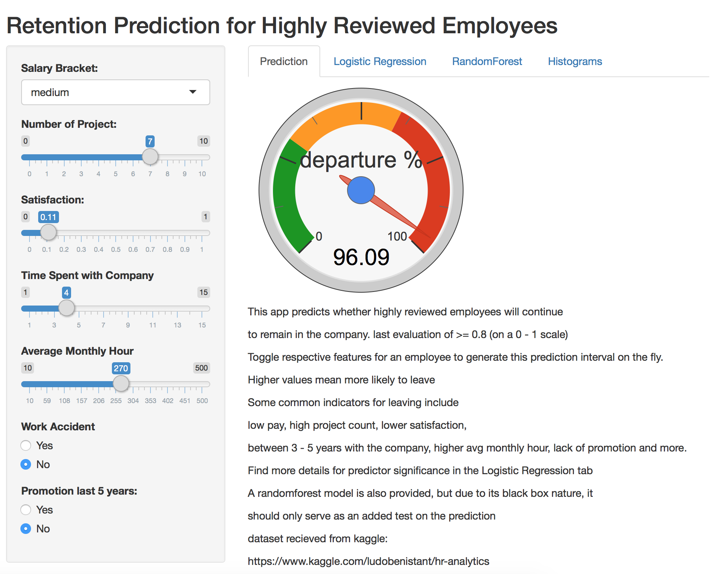

Retention Prediction for Highly Reviewed Employees
========================================================
author: Don
date: Feb 8, 2017
autosize: true


Introduction
========================================================

Why do highly reviewed employees leave?  
This turnover has a big impact on businesses to say the least.  

We have analysed one such HR dataset and produced an app that  
gives precise prediction for the likelihood of a departure of an employee  
the company has deemed valuable.

<https://dont404.shinyapps.io/retention/>


Comparing groups who stay vs leave
========================================================
key - overworked, more projects, underpaid, 3 - 5 years with the company and more.

<iframe src="plotly.html" style="position:absolute;height:100%;width:100%"></iframe>

Prediction Model
========================================================
We filter out candiates with high evaluation in the last period >= 0.8  
(on a 0 to 1 scale) and hence exclude that feature. AIC drops department too.

```r
modelGLM <- step(glm(left ~ . -last_evaluation, data = train, family = binomial))
```
A unit change that increases the odds of leaving keeping everything else constant.  
Showing top 3 predictors only.

```
     salarylow   salarymedium number_project 
      11.40175        7.78855        3.76604 
```

Results
========================================================
Here, the logistic model holds its own against a randomforest  
model built using same features. Unlike, the rf model however,  
the logistic model quantifies the effects of the predictors  
on the actual odds of someone leaving as seen on the previous slide,  
hence giving evaluators an insight on how to improve things.

For this reason, the app is built around the Logistic regression model,  
and rf model is provided as an extra validation to consider as well.


```
               trainError testError
Logistic Model  0.8977361 0.8973269
Randomforest    0.9934947 0.9835966
```
dataset: <https://www.kaggle.com/ludobenistant/hr-analytics>  
